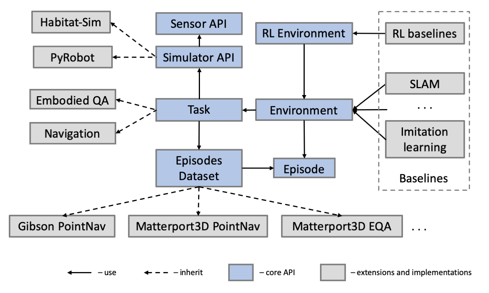

## Details
An important objective of Habitat-Lab is to make it easy for users to set up a variety of embodied agent tasks in 3D environments. The process of setting up a task involves using environment information provided by the simulator, connecting the information with a dataset (e.g. PointGoal targets, or question and answer pairs for Embodied QA) and providing observations which can be used by the agents. Keeping this primary objective in mind the core API defines the following key concepts as abstractions that can be extended:

* `Env`: the fundamental environment concept for Habitat. All the information needed for working on embodied tasks with a simulator is abstracted inside an Env. This class acts as a base for other derived environment classes. Env consists of three major components: a Simulator, a Dataset (containing Episodes), and a Task, and it serves to connects all these three components together.

* `Dataset`: contains a list of task-specific episodes from a particular data split and additional dataset-wide information. Handles loading and saving of a dataset to disk, getting a list of scenes, and getting a list of episodes for a particular scene.

* `Episode`: a class for episode specification that includes the initial position and orientation of an Agent, a scene id, a goal position and optionally shortest paths to the goal. An episode is a description of one task instance for the agent.

  
  
<i>Architecture of Habitat-Lab</i>

* `Task`: this class builds on top of the simulator and dataset. The criteria of episode termination and measures of success are provided by the Task.

* `Sensor`: a generalization of the physical Sensor concept provided by a Simulator, with the capability to provide Task-specific Observation data in a specified format.

* `Observation`: data representing an observation from a Sensor. This can correspond to physical sensors on an Agent (e.g. RGB, depth, semantic segmentation masks, collision sensors) or more abstract sensors such as the current agent state.

Note that the core functionality defines fundamental building blocks such as the API for interacting with the simulator backend, and receiving observations through Sensors. Concrete simulation backends, 3D datasets, and embodied agent baselines are implemented on top of the core API.
