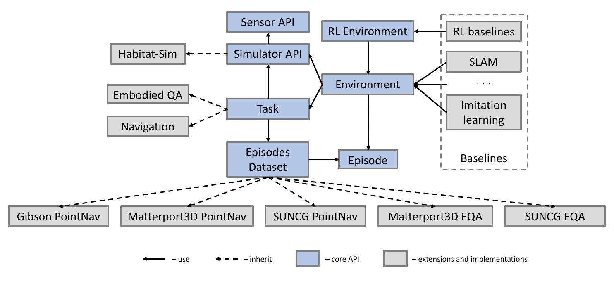

Habitat-API
==============================

Habitat-API is a modular high-level library for end-to-end development in embodied AI --
defining embodied AI tasks (e.g. navigation, instruction following, question answering), configuring embodied agents (physical form, sensors, capabilities), training these agents (via imitation or reinforcement learning, or no learning at all as in classical SLAM), and benchmarking their performance on the defined tasks using standard metrics.

Habitat-API currently uses [`Habitat-Sim`](https://github.com/facebookresearch/habitat-sim) as the core simulator, but is designed with a modular abstraction for the simulator backend to maintain compatibility over multiple simulators.

<p align="center">
  
</p>

---

## Table of contents
   0. [Motivation](#motivation)
   0. [Citing Habitat](#citing-habitat)
   0. [Details](#details)
   0. [Installation](#installation)
   0. [Example](#example)
   0. [Data](#data)
   0. [Baselines](#baselines)

## Motivation
A key long-term goal of artificial intelligence (AI) is to build intelligent _agents_ that can
* _see_ or more generally perceive their environment through vision, audition, or other senses,
* _talk_, i.e. hold a natural language dialog grounded in the environment,
* _act_, i.e. navigate their environment and interact with it to accomplish goals, and
* _reason_, i.e. consider the long-term consequences of their actions

#### From ‘Internet AI’ to Embodied AI.
While there has been significant progress in the vision and language communities thanks to recent advances in deep representations, we believe there is a growing disconnect between ‘internet AI’ and embodied AI. The focus of the former is pattern recognition in images, videos, and text on datasets typically curated from the internet. The focus of the latter is to enable action by an embodied agent in an environment (e.g. a robot). This brings to the forefront issues of active perception, long-term planning, learning from interaction, and holding a dialog grounded in an environment.

To this end, we aim to standardize the entire ‘software stack’ for training embodied agents – scanning the world and creating highly photorealistic 3D assets, developing the next generation of highly efficient and parallelizable simulators, specifying embodied AI tasks that enable us to benchmark scientific progress, and releasing modular high-level libraries to train and deploy embodied agents.

#### Why the name _Habitat_?
Because that's where AI agents live :slightly_smiling_face:

## Citing Habitat
If you use the Habitat platform in your research, please cite the following technical report:
```
@article{habitat19arxiv,
  title =   {Habitat: A Platform for Embodied AI Research},
  author =  {{Manolis Savva*}, {Abhishek Kadian*}, {Oleksandr Maksymets*}, Yili Zhao, Erik Wijmans, Bhavana Jain, Julian Straub, Jia Liu, Vladlen Koltun, Jitendra Malik, Devi Parikh and Dhruv Batra},
  journal = {arXiv preprint arXiv:},
  year =    {2019}
}
```

## Details
An important objective of Habitat-API is to make it easy for users to set up a variety of embodied agent tasks in 3D environments. The process of setting up a task involves using environment information provided by the simulator, connecting the information with a dataset (e.g. PointGoal targets, or question and answer pairs for Embodied QA) and providing observations which can be used by the agents. Keeping this primary objective in mind the core API defines the following key concepts as abstractions that can be extended:

* `Env`: the fundamental environment concept for Habitat. All the information needed for working on embodied tasks with a simulator is abstracted inside an Env. This class acts as a base for other derived environment classes. Env consists of three major components: a Simulator, a Dataset (containing Episodes), and a Task, and it serves to connects all these three components together.

* `Dataset`: contains a list of task-specific episodes from a particular data split and additional dataset-wide information. Handles loading and saving of a dataset to disk, getting a list of scenes, and getting a list of episodes for a particular scene.

* `Episode`: a class for episode specification that includes the initial position and orientation of an Agent, a scene id, a goal position and optionally shortest paths to the goal. An episode is a description of one task instance for the agent.

<p align="center">
  
  <p align="center"><i>Architecture of Habitat-API</i></p>
</p>

* `Task`: this class builds on top of the simulator and dataset. The criteria of episode termination and measures of success are provided by the Task.

* `Sensor`: a generalization of the physical Sensor concept provided by a Simulator, with the capability to provide Task-specific Observation data in a specified format.

* `Observation`: data representing an observation from a Sensor. This can correspond to physical sensors on an Agent (e.g. RGB, depth, semantic segmentation masks, collision sensors) or more abstract sensors such as the current agent state.

Note that the core functionality defines fundamental building blocks such as the API for interacting with the simulator backend, and receiving observations through Sensors. Concrete simulation backends, 3D datasets, and embodied agent baselines are implemented on top of the core API.

## Installation

1. Clone the github repository and install using the commands below. Note that we only support python3.
```bash
cd habitat-api
pip install -e .
```

2. Install `habitat-sim` from [github repo](https://github.com/facebookresearch/habitat-sim) and as stated there, remember to add `habitat-sim` to `PYTHONPATH`:
```bash
export PYTHONPATH="${PYTHONPATH}:/path/to/habitat-sim/:/path/to/habitat-sim/build/esp/bindings"
```
3. Get the [test scene data](https://www.dropbox.com/s/gw5fk86rfy49d6a/habitat-test-scenes.zip?dl=1) and extract locally.

4. Run the example script `python examples/example.py ` or `python setup.py test` to confirm everything works.


### Example
<!--- Please, update `examples/example.py` if you update example. -->
```python
import habitat

config = habitat.get_config()
dataset = habitat.make_dataset(
    id_dataset=config.DATASET.TYPE, config=config.DATASET
)
env = habitat.Env(config=config, dataset=dataset)
observations = env.reset()

while not env.episode_over:
    observations = env.step(env.action_space.sample())

```

## Data
The PointNav dataset will be uploaded to S3 soon. Stay tuned!

## Baselines
Habitat-API includes reinforcement learning (via PPO) and classical SLAM based baselines. More details [here](baselines/README.md).

## License
Habitat-API is MIT licensed. See the LICENSE file for details.
