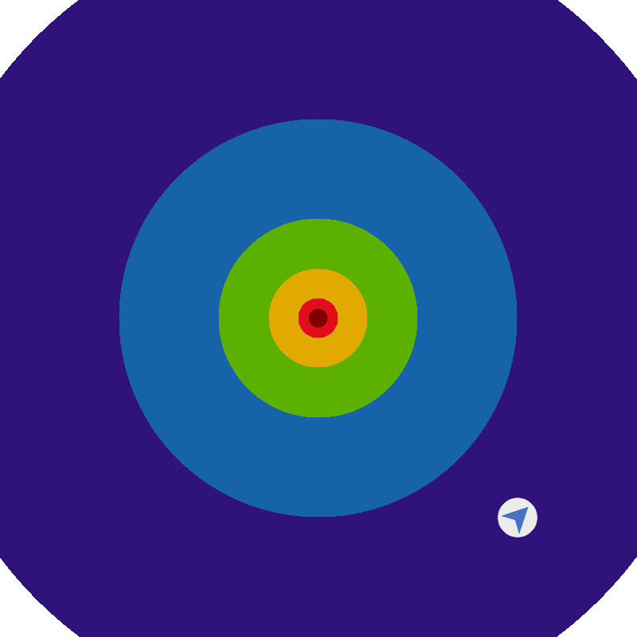
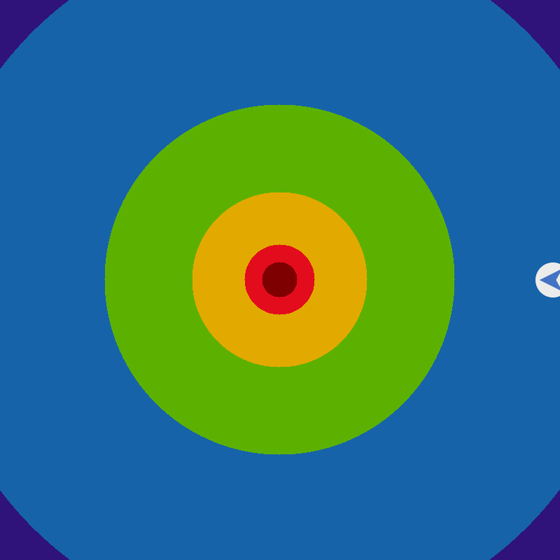
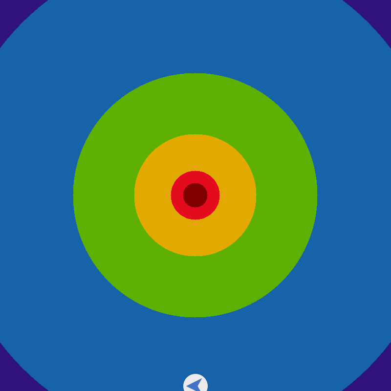
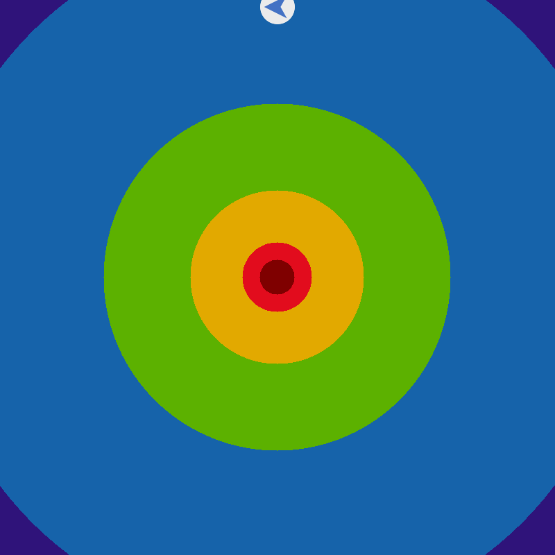
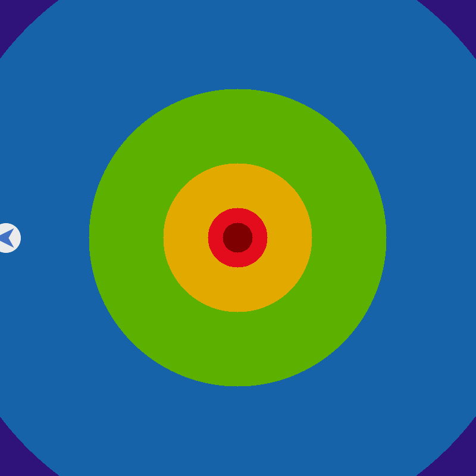
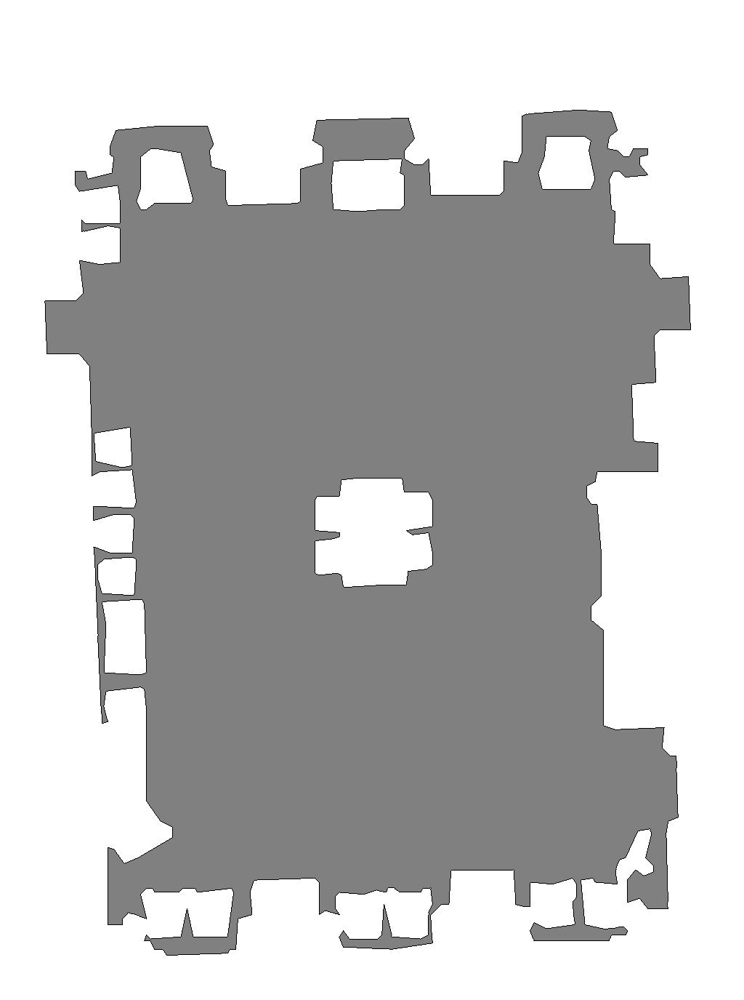
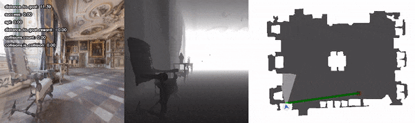

Habitat Lab TopdownMap Visualization Examples
#############################################

.. contents::
    :class: m-block m-default

The example code below is available as a Jupyter notebook, or directly runnable via:

.. code:: shell-session

    $ python path/to/habitat-lab/examples/tutorials/nb_python/Habitat_Lab_TopdownMap_Visualization.py

First, download (testing) 3D scenes:

.. code:: shell-session

    $ python -m habitat_sim.utils.datasets_download --uids habitat_test_scenes --data-path data/

and point-goal navigation episodes for the test scenes:

.. code:: shell-session

    $ python -m habitat_sim.utils.datasets_download --uids habitat_test_pointnav_dataset --data-path data/

Then import necessary modules:

.. include:: ../../examples/tutorials/nb_python/Habitat_Lab_TopdownMap_Visualization.py
    :code: py
    :start-after: # [setup]
    :end-before: # [/setup]

Below we define four example functions to show how to use Habitat's visualisation functionality to draw a navigation episode
bird-eye view and top-down maps.

In the first example, a dummy episode birdseye view is drawn using :ref:`habitat.utils.visualizations.maps.pointnav_draw_target_birdseye_view()`.

.. include:: ../../examples/tutorials/nb_python/Habitat_Lab_TopdownMap_Visualization.py
    :code: py
    :start-after: # [example_1]
    :end-before: # [/example_1]

The procedure is repeated in the second example, with the agent initialized at four different borders.

.. include:: ../../examples/tutorials/nb_python/Habitat_Lab_TopdownMap_Visualization.py
    :code: py
    :start-after: # [example_2]
    :end-before: # [/example_2]

Third example shows how to use :ref:`habitat.utils.visualizations.maps.get_topdown_map_from_sim()` to
get top-down map from Simulator instance (of type :ref:`habitat.sims.habitat_simulator.habitat_simulator.HabitatSim`).

.. include:: ../../examples/tutorials/nb_python/Habitat_Lab_TopdownMap_Visualization.py
    :code: py
    :start-after: # [example_3]
    :end-before: # [/example_3]

The last example defines `ShortestPathFollowerAgent` that extracts the actions on the shortest path to the goal.
This agent is launched in the simulation environment to navigate to the target location specified in the
first habitat test scenes navigation episode. Agent's observations and images from :ref:`habitat.tasks.nav.nav.TopDownMap`
measure are collected along the trajectory and further used to generate and display navigation video.

.. include:: ../../examples/tutorials/nb_python/Habitat_Lab_TopdownMap_Visualization.py
    :code: py
    :start-after: # [example_4]
    :end-before: # [/example_4]

