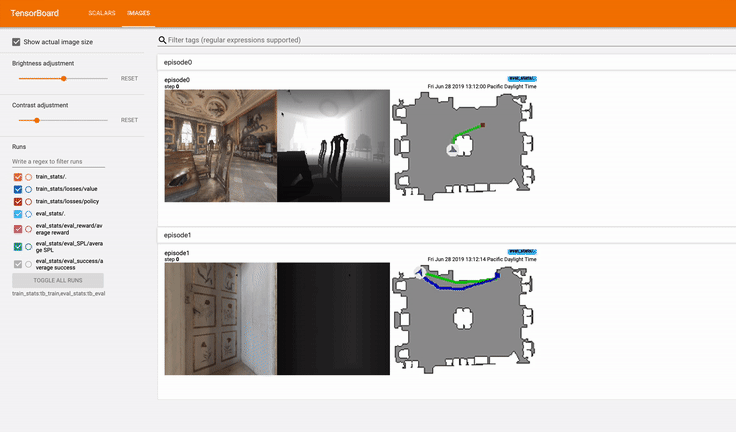

baselines
==============================
### Installation

The `habitat_baselines` sub-package is NOT included upon installation by default. To install `habitat_baselines`, use the following command instead:
```bash
pip install -r requirements.txt
python setup.py develop --all
```
This will also install additional requirements for each sub-module in `habitat_baselines/`, which are specified in `requirements.txt` files located in the sub-module directory.


### Reinforcement Learning (RL)

**Proximal Policy Optimization (PPO)**

**paper**: [https://arxiv.org/abs/1707.06347](https://arxiv.org/abs/1707.06347)

**code**: The PPO implementation is based on
[pytorch-a2c-ppo-acktr](https://github.com/ikostrikov/pytorch-a2c-ppo-acktr).

**dependencies**: A recent version of pytorch, for installing refer to [pytorch.org](https://pytorch.org/)

For training on sample data please follow steps in the repository README. You should download the sample [test scene data](http://dl.fbaipublicfiles.com/habitat/habitat-test-scenes.zip), extract it under the main repo (`habitat-lab/`, extraction will create a data folder at `habitat-lab/data`) and run the below training command.

**train**:
```bash
python -u habitat_baselines/run.py --exp-config habitat_baselines/config/pointnav/ppo_pointnav_example.yaml --run-type train
```

**test**:
```bash
python -u habitat_baselines/run.py --exp-config habitat_baselines/config/pointnav/ppo_pointnav_example.yaml --run-type eval
```

We also provide trained RGB, RGBD, and Depth PPO  models for MatterPort3D and Gibson.
To use them download pre-trained pytorch models from [link](https://dl.fbaipublicfiles.com/habitat/data/baselines/v1/habitat_baselines_v2.zip) and unzip and specify model path [here](agents/ppo_agents.py#L149).

The `habitat_baselines/config/pointnav/ppo_pointnav.yaml` config has better hyperparamters for large scale training and loads the [Gibson PointGoal Navigation Dataset](/README.md#task-datasets) instead of the test scenes.
Change the field `task_config` in `habitat_baselines/config/pointnav/ppo_pointnav.yaml` to `configs/tasks/pointnav_mp3d.yaml` for training on [MatterPort3D PointGoal Navigation Dataset](/README.md#task-datasets).

### Classic

**SLAM based**

- [Handcrafted agent baseline](slambased/README.md) adopted from the paper
"Benchmarking Classic and Learned Navigation in Complex 3D Environments".
### Additional Utilities

**Episode iterator options**:
Coming very soon

**Tensorboard and video generation support**

Enable tensorboard by changing `tensorboard_dir` field in `habitat_baselines/config/pointnav/ppo_pointnav.yaml`.

Enable video generation for `eval` mode by changing `video_option`: `tensorboard,disk` (for displaying on tensorboard and for saving videos on disk, respectively)

Generated navigation episode recordings should look like this on tensorboard:
<p align="center">
  
</p>
