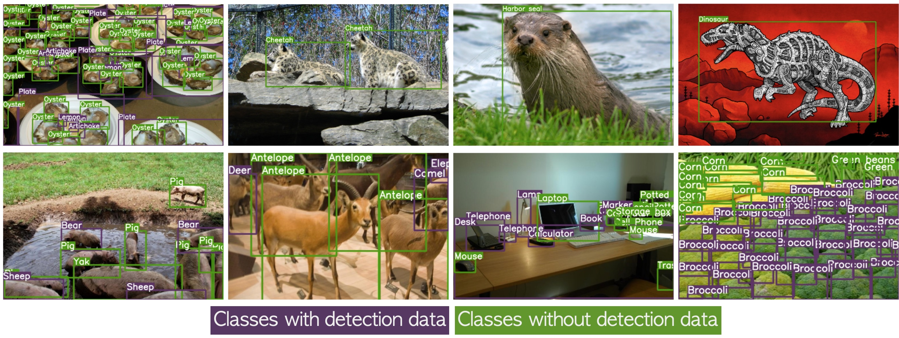
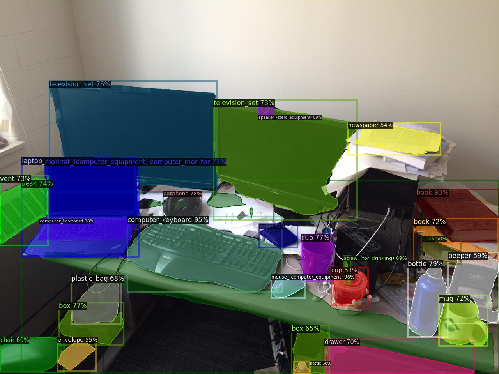
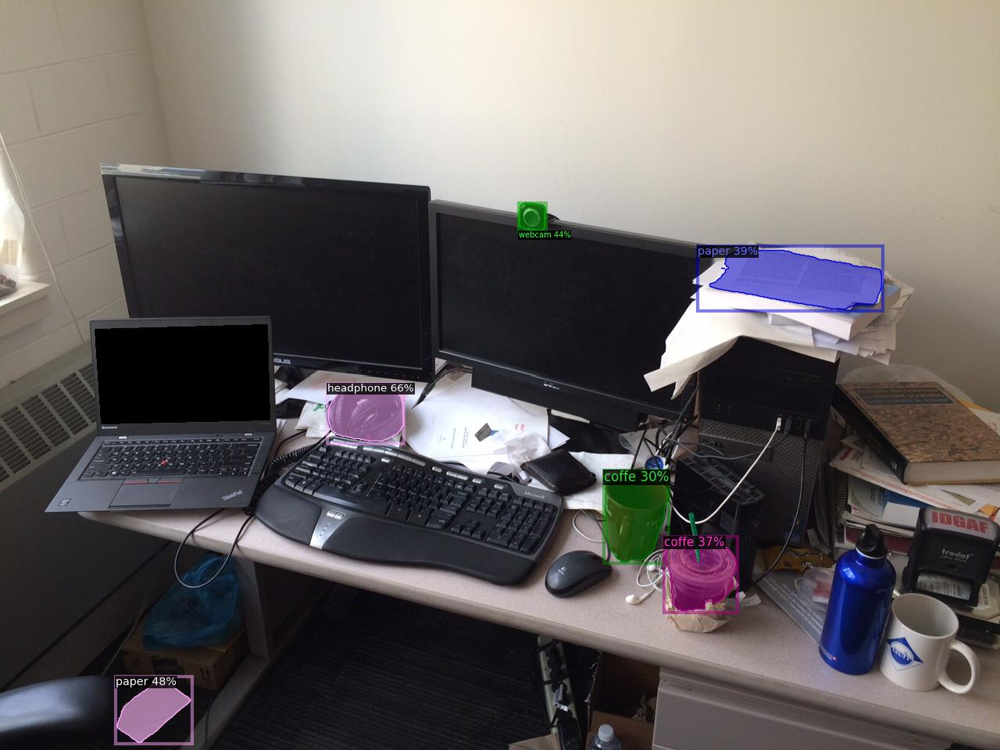

# Detecting Twenty-thousand Classes using Image-level Supervision

**Detic**: A **Det**ector with **i**mage **c**lasses that can use image-level labels to easily train detectors.

  

> [**Detecting Twenty-thousand Classes using Image-level Supervision**](http://arxiv.org/abs/2201.02605),               
> Xingyi Zhou, Rohit Girdhar, Armand Joulin, Philipp Kr&auml;henb&uuml;hl, Ishan Misra,                 
> *ECCV 2022 ([arXiv 2201.02605](http://arxiv.org/abs/2201.02605))*         

## Features

- Detects **any** class given class names (using [CLIP](https://github.com/openai/CLIP)).

- We train the detector on ImageNet-21K dataset with 21K classes.

- Cross-dataset generalization to OpenImages and Objects365 **without finetuning**. 

- State-of-the-art results on Open-vocabulary LVIS and Open-vocabulary COCO.

- Works for DETR-style detectors.

## Installation

See [installation instructions](docs/INSTALL.md).

## Demo

**Update April 2022**: we released more real-time models [here](docs/MODEL_ZOO.md#real-time-models).

Replicate web demo and docker image: 

Integrated into [Huggingface Spaces 🤗](https://huggingface.co/spaces) using [Gradio](https://github.com/gradio-app/gradio). Try out the web demo: 

Run our demo using Colab (no GPU needed): 

We use the default detectron2 [demo interface](https://github.com/facebookresearch/detectron2/blob/main/GETTING_STARTED.md). 
For example, to run our [21K model](docs/MODEL_ZOO.md#cross-dataset-evaluation) on a [messy desk image](https://web.eecs.umich.edu/~fouhey/fun/desk/desk.jpg) (image credit [David Fouhey](https://web.eecs.umich.edu/~fouhey)) with the lvis vocabulary, run

~~~
mkdir models
wget https://dl.fbaipublicfiles.com/detic/Detic_LCOCOI21k_CLIP_SwinB_896b32_4x_ft4x_max-size.pth -O models/Detic_LCOCOI21k_CLIP_SwinB_896b32_4x_ft4x_max-size.pth
wget https://web.eecs.umich.edu/~fouhey/fun/desk/desk.jpg
python demo.py --config-file configs/Detic_LCOCOI21k_CLIP_SwinB_896b32_4x_ft4x_max-size.yaml --input desk.jpg --output out.jpg --vocabulary lvis --opts MODEL.WEIGHTS models/Detic_LCOCOI21k_CLIP_SwinB_896b32_4x_ft4x_max-size.pth
~~~

If setup correctly, the output should look like:

  

The same model can run with other vocabularies (COCO, OpenImages, or Objects365), or a **custom vocabulary**. For example:

~~~
python demo.py --config-file configs/Detic_LCOCOI21k_CLIP_SwinB_896b32_4x_ft4x_max-size.yaml --input desk.jpg --output out2.jpg --vocabulary custom --custom_vocabulary headphone,webcam,paper,coffe --confidence-threshold 0.3 --opts MODEL.WEIGHTS models/Detic_LCOCOI21k_CLIP_SwinB_896b32_4x_ft4x_max-size.pth
~~~

The output should look like:

  

Note that `headphone`, `paper` and `coffe` (typo intended) are **not** LVIS classes. Despite the misspelled class name, our detector can produce a reasonable detection for `coffe`.

## Benchmark evaluation and training

Please first [prepare datasets](datasets/README.md), then check our   [MODEL ZOO](docs/MODEL_ZOO.md) to reproduce results in our paper. We highlight key results below:

- Open-vocabulary LVIS

    |                       |  mask mAP | mask mAP_novel  |
    |-----------------------|-----------|-----------------|
    |Box-Supervised         | 30.2      |       16.4      |
    |Detic                  | 32.4      |       24.9      |

- Standard LVIS

    |                       | Detector/ Backbone |  mask mAP | mask mAP_rare  |
    |-----------------------|----------|-----------|-----------------|
    |Box-Supervised         | CenterNet2-ResNet50 | 31.5      |       25.6      |
    |Detic                  | CenterNet2-ResNet50 | 33.2      |       29.7      |
    |Box-Supervised         | CenterNet2-SwinB    | 40.7      |       35.9      |
    |Detic                  | CenterNet2-SwinB    | 41.7      |       41.7      |

    |                       | Detector/ Backbone |  box mAP | box mAP_rare  |
    |-----------------------|----------|-----------|-----------------|
    |Box-Supervised         | DeformableDETR-ResNet50 | 31.7      |       21.4      |
    |Detic                  | DeformableDETR-ResNet50 | 32.5      |       26.2      |

- Cross-dataset generalization

    |                       | Backbone |  Objects365 box mAP | OpenImages box mAP50  |
    |-----------------------|----------|-----------|-----------------|
    |Box-Supervised         | SwinB    | 19.1      |       46.2      |
    |Detic                  | SwinB    | 21.4      |       55.2      |

## License

The majority of Detic is licensed under the [Apache 2.0 license](LICENSE), however portions of the project are available under separate license terms: SWIN-Transformer, CLIP, and TensorFlow Object Detection API are licensed under the MIT license; UniDet is licensed under the Apache 2.0 license; and the LVIS API is licensed under a [custom license](https://github.com/lvis-dataset/lvis-api/blob/master/LICENSE). If you later add other third party code, please keep this license info updated, and please let us know if that component is licensed under something other than CC-BY-NC, MIT, or CC0

## Ethical Considerations
Detic's wide range of detection capabilities may introduce similar challenges to many other visual recognition and open-set recognition methods.
As the user can define arbitrary detection classes, class design and semantics may impact the model output.

## Citation

If you find this project useful for your research, please use the following BibTeX entry.

    @inproceedings{zhou2022detecting,
      title={Detecting Twenty-thousand Classes using Image-level Supervision},
      author={Zhou, Xingyi and Girdhar, Rohit and Joulin, Armand and Kr{\"a}henb{\"u}hl, Philipp and Misra, Ishan},
      booktitle={ECCV},
      year={2022}
    }
